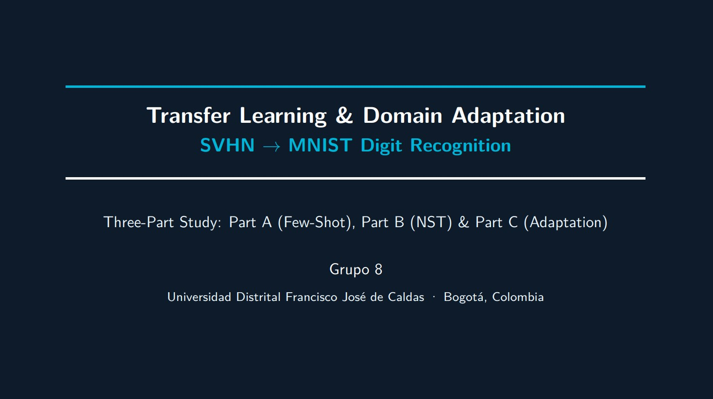

# Challenge 7 — Transfer Learning & Domain Shift Adaptation: SVHN → MNIST

## 1. Overview

Click the folllowing image to watch the video.

[](https://youtu.be/oxG2E_IUc9c)

This project studies **Transfer Learning** and **Domain Shift Adaptation** for digit recognition under a severe distribution shift between two benchmark datasets: **SVHN** (Street View House Numbers — real photographs) as the source domain and **MNIST** (handwritten grayscale digits) as the target domain.

The work is structured in three parts:

- **Part A — Few-Shot Classification:** A ResNet-50 backbone pretrained on ImageNet is used to classify SVHN digits under a budget of 50 labelled images per class. Three strategies are compared: frozen feature extraction, selective fine-tuning, and training from scratch.
- **Part B — Neural Style Transfer:** Gatys-style NST (VGG-19, L-BFGS) synthesises 300 SVHN-content images rendered in the MNIST visual style, creating a label-free bridge between domains.
- **Part C — Domain Adaptation:** Four strategies are compared on the same benchmark — unadapted baseline, target-domain fine-tuning, style-transfer augmentation, and Domain-Adversarial Neural Networks (DANN).

All experiments are repeated over three independent random seeds (42, 123, 7) and results are reported as mean ± standard deviation.

---

## 2. Project Structure

Some folders due to the git ignore can't be uploaded.

```
challenge7__8/
├── main.py                       # Orchestrator — runs Parts A, B, C
├── classifier.py                 # Part A: feature extraction, fine-tuning, from-scratch
├── style_transfer.py             # Part B: Gatys NST with VGG-19 and L-BFGS
├── domain_adaptation.py          # Part C: 4 adaptation strategies + t-SNE + Grad-CAM
├── requirements.txt              # Python dependencies
├── Makefile                      # Convenience targets (all, fast, clean)
├── CHECKLIST.md                  # Submission checklist with real results
├── part_a_few_shot.ipynb         # Notebook walkthrough — Part A
├── part_b_style_transfer.ipynb   # Notebook walkthrough — Part B
├── part_c_domain_adaptation.ipynb# Notebook walkthrough — Part C
├── data/
│   ├── SVHN/                     # Downloaded automatically by torchvision
│   ├── MNIST/                    # Downloaded automatically by torchvision
│   └── synthetic_target/         # NST-generated images (Part B output)
│       ├── 0/  …  9/             # 30 images per digit class (300 total)
├── checkpoints/
│   ├── best_partA_finetuned.pt   # Best Part A model (Fine-Tuned)
│   └── best_partC_adapted.pt     # Best Part C model (Target Fine-Tune)
├── figures/
│   ├── curves_Frozen_Backbone_seed*.png
│   ├── curves_Fine-Tuned_seed*.png
│   ├── curves_From_Scratch_seed*.png
│   ├── nst_gallery.png           # Content | Style | Generated (one row per digit)
│   ├── gradcam_target.png        # Grad-CAM on MNIST — correct vs incorrect predictions
│   ├── tsne_before_adapt.png     # t-SNE SVHN+MNIST features before adaptation
│   └── tsne_after_adapt.png      # t-SNE SVHN+MNIST features after adaptation
└── logs/
    └── challenge7.log
```

---

## 3. Datasets

| Dataset | Domain | Size | Description |
|---|---|---|---|
| **SVHN** | Source | 73,257 train / 26,032 test | RGB 32×32 photographs of street-view digits |
| **MNIST** | Target | 60,000 train / 10,000 test | Grayscale 28×28 handwritten digits |

Both datasets are downloaded automatically by `torchvision` on first run. The same preprocessing pipeline is applied to both domains to ensure that measured domain shift is not an artefact of inconsistent normalisation:

1. Resize to **224 × 224** (ResNet-50 input)
2. `Grayscale(num_output_channels=3)` — both domains converted to 3-channel tensors
3. Training augmentation: random horizontal flip + colour jitter (brightness ±0.2, contrast ±0.2, saturation ±0.1)
4. Normalisation with ImageNet statistics: μ = [0.485, 0.456, 0.406], σ = [0.229, 0.224, 0.225]

**Few-shot split:** 50 labelled SVHN images per class for training (500 total), 50 per class for validation, full SVHN test split (26,032) for source evaluation, full MNIST test split (10,000) for target evaluation.

---

## 4. Model Architectures

### Part A — ResNet-50 Backbone

| Strategy | Trainable layers | Trainable params | LR | Epochs |
|---|---|---|---|---|
| Frozen Backbone | `fc` only | ~20,490 | 1e-3 | 25 |
| Fine-Tuned | `layer3` + `layer4` + `fc` | ~14.9 M | 1e-4 | 35 |
| From Scratch | Full backbone (random init) | ~25.6 M | 1e-3 | 35 |

All strategies use Adam + cosine annealing, batch size 32, cross-entropy loss, and best-checkpoint selection on the validation set.

### Part B — Neural Style Transfer (VGG-19)

| Parameter | Value |
|---|---|
| Content layer | `relu4_2` (VGG-19 index 21) |
| Style layers | `relu1_1`, `relu2_1`, `relu3_1`, `relu4_1`, `relu5_1` |
| α (content weight) | 1.0 |
| β (style weight) | 1 × 10⁴ → ratio α/β = 10⁻⁴ |
| Optimiser | L-BFGS, lr=1.0, max_iter=20 per call |
| Total steps | 300 |
| Image size | 256 × 256 px |
| Output | 30 synthetic images per class × 10 classes = **300 total** |

### Part C — Domain Adaptation

| Strategy | Description | Target labels required |
|---|---|---|
| Baseline (no adapt) | Part A fine-tuned model evaluated on MNIST directly | No |
| Style-Aug | Retrain Part A model on SVHN + 300 NST synthetic images | No |
| DANN | Adversarial domain alignment with Gradient Reversal Layer | No (unlabelled MNIST) |
| Target Fine-Tune | Fine-tune `layer3` + `layer4` + `fc` on 50 labelled MNIST/class | Yes (500 total) |

**DANN hyperparameters:** λd = 0.5, linear α schedule 0→1 over training (20 epochs), Adam lr=1e-4.

---

## 5. Setup

```bash
# 1. Clone the repository
git clone https://github.com/<your-org>/challenge-7_8.git
cd challenge-7_8

# 2. Create and activate a virtual environment
python -m venv venv
source venv/bin/activate        # Linux/macOS
venv\Scripts\activate           # Windows

# 3. Install dependencies
pip install -r requirements.txt

# 4. Run all three parts (downloads datasets automatically)
python main.py --parts ABC
```

> **GPU recommended** for Part B (NST). Generating 300 images takes ~3–9 hours on CPU
> and ~20–40 minutes on a single GPU. Parts A and C run in under 60 minutes on a free
> Colab T4 instance.

---

## 6. Reproducing Results

All random seeds are fixed across Python, NumPy, and PyTorch. The `main.py` orchestrator accepts the following flags:

```bash
# Full run — all parts, 3 seeds each
python main.py --parts ABC

# Run only Part A
python main.py --parts A

# Run Parts B and C (loads Part A checkpoint from disk)
python main.py --parts BC

# Quick smoke-test: 1 seed, 5 NST images/class, no DANN
python main.py --parts ABC --fast --no_dann

# Custom paths
python main.py --parts ABC \
  --data_root ./data \
  --synth_dir ./data/synthetic_target \
  --figures_dir ./figures \
  --ckpt_dir ./checkpoints
```

Or use the Makefile:

```bash
make install    # pip install -r requirements.txt
make part_a     # run Part A only
make part_b     # run Part B only
make part_c     # run Part C only
make all        # run A + B + C sequentially
make fast       # quick smoke-test (1 seed, 5 NST images, no DANN)
make clean      # remove figures/, checkpoints/, data/synthetic_target/
```

Running `main.py --parts ABC` will:

1. Download SVHN and MNIST via `torchvision` into `data/`
2. Build few-shot train/val splits (50 images/class per domain)
3. Train **Frozen Backbone**, **Fine-Tuned**, and **From Scratch** variants over 3 seeds; save best Fine-Tuned checkpoint
4. Generate **300 NST synthetic images** (30/class × 10 classes) into `data/synthetic_target/`; save `nst_gallery.png`
5. Run **4 adaptation strategies** (Baseline, Style-Aug, DANN, Target Fine-Tune) over 3 seeds; save best adapted checkpoint
6. Generate **t-SNE** projections before and after adaptation
7. Generate **Grad-CAM** maps on MNIST test images
8. Save all figures to `figures/` and print summary tables to stdout

---

## 7. Results Summary

### Part A — Few-Shot Classification (mean ± std, 3 seeds: 42 / 123 / 7)

| Model | Src Acc (SVHN) | Tgt Acc (MNIST) | Δshift |
|---|---|---|---|
| Frozen Backbone | 0.2673 ± 0.0077 | 0.1478 ± 0.0311 | +0.1196 ± 0.0246 |
| **Fine-Tuned** | **0.7351 ± 0.0173** | **0.3739 ± 0.0701** | **+0.3612 ± 0.0560** |
| From Scratch | 0.1764 ± 0.0508 | 0.0956 ± 0.0056 | +0.0807 ± 0.0512 |

Fine-tuning substantially outperforms both alternatives on the source domain. The large Δshift confirms that photographic features learned on SVHN do not generalise to handwritten MNIST strokes.

### Part B — Neural Style Transfer

30 synthetic images per class × 10 classes = **300 images** generated successfully. Content (digit shape) is preserved from SVHN while style (thin strokes, high contrast, uniform background) is transferred from MNIST. Visual quality assessed as good at α/β = 10⁻⁴.

### Part C — Domain Adaptation (mean ± std, 3 seeds)

| Strategy | Src Acc (SVHN) | Tgt Acc (MNIST) | Δshift |
|---|---|---|---|
| Baseline (no adapt) | 0.7490 ± 0.0057 | 0.4161 ± 0.0164 | +0.3329 ± 0.0221 |
| Style-Aug | 0.7967 ± 0.0073 | 0.5056 ± 0.0107 | +0.2911 ± 0.0026 |
| DANN | 0.6723 ± 0.0062 | 0.6387 ± 0.0091 | +0.0337 ± 0.0029 |
| **Target Fine-Tune** | 0.3407 ± 0.0067 | **0.9389 ± 0.0064** | **−0.5982 ± 0.0124** |

**Best adaptation strategy: Target Fine-Tune** — 56.5 pp absolute improvement on MNIST over the best Part A model (0.3739 → 0.9389).

---

## 8. Domain Shift Penalty Summary

| Model | Δshift |
|---|---|
| Best Part A (Fine-Tuned) | +0.3612 ± 0.0560 |
| Best Part C (Target Fine-Tune) | −0.5982 ± 0.0124 |
| Absolute target improvement | **+0.5650** (0.3739 → 0.9389) |

The negative Δshift for Target Fine-Tune means MNIST accuracy exceeds SVHN accuracy after adaptation — a clear sign of successful domain realignment, at the cost of partial catastrophic forgetting on the source.

---

## 9. Key Figures

| File | Description |
|---|---|
| `figures/curves_Fine-Tuned_seed42.png` | Training/validation loss and accuracy curves — best Part A model |
| `figures/nst_gallery.png` | Side-by-side: SVHN content \| MNIST style \| Generated image (one row per digit 0–9) |
| `figures/gradcam_target.png` | Grad-CAM attention maps on MNIST — 2 correct + 2 incorrect predictions |
| `figures/tsne_before_adapt.png` | t-SNE of ResNet-50 features for 500 SVHN + 500 MNIST samples before adaptation |
| `figures/tsne_after_adapt.png` | Same projection after Target Fine-Tune — domains visually align |

---

## 10. Seeds Used

| Experiment | Seeds |
|---|---|
| Part A (all strategies) | 42, 123, 7 |
| Part B (NST generation) | 42 |
| Part C (all strategies) | 42, 123, 7 |

---

## 11. Dependencies

```
torch>=2.0.0
torchvision>=0.15.0
matplotlib>=3.7.0
scikit-learn>=1.3.0
scipy>=1.11.0
grad-cam>=1.4.8
numpy>=1.24.0
Pillow>=10.0.0
tqdm>=4.65.0
```

Install with:

```bash
pip install -r requirements.txt
```

---

## 12. Notes on Computational Budget

| Task | CPU estimate | GPU estimate |
|---|---|---|
| Part A (full, 3 seeds × 3 models) | ~30–45 min | ~5–10 min |
| Part B (300 NST images) | ~3–9 hours | ~20–40 min |
| Part C (full, 3 seeds × 4 strategies) | ~60–90 min | ~10–20 min |

For free-tier Colab (T4): run `make all` overnight, or use `make fast` for a quick end-to-end smoke-test (1 seed, 5 NST images/class, no DANN, ~10 min on CPU).

---

### Authors

**Group 8 — Computer Engineering Program**  
Universidad Distrital Francisco José de Caldas · Bogotá, Colombia

| Name | Email |
|---|---|
| Laura Sofia Culma Ospina | lsculmao@udistrital.edu.co |
| Alejandro Nuñez Barrera | anunezb@udistrital.edu.co |

